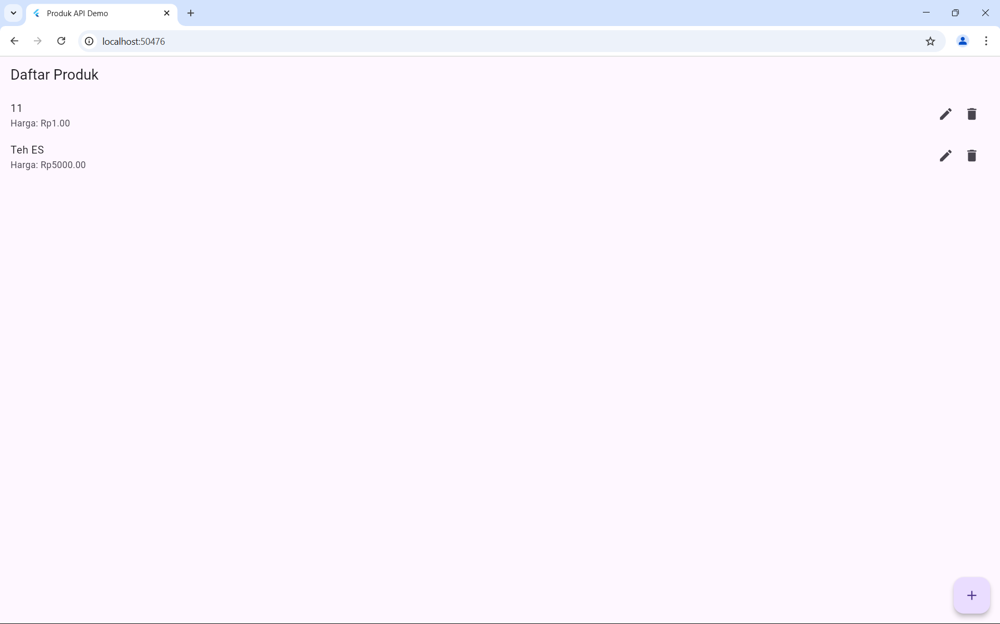
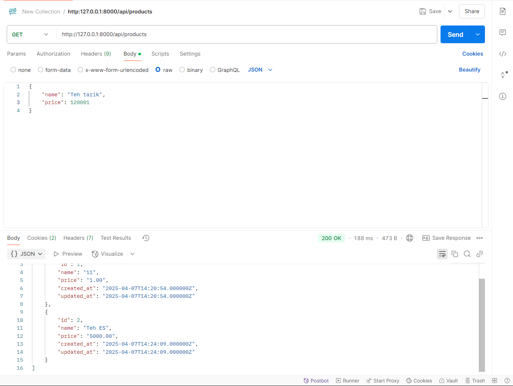
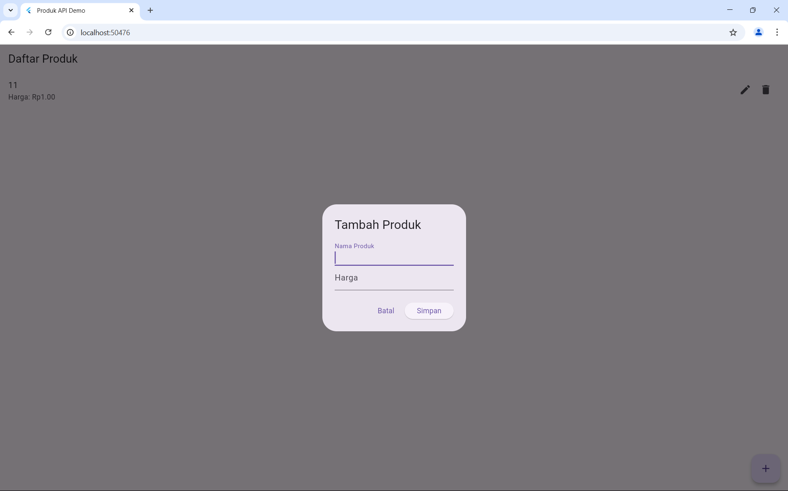

 
  <h1>Flutter and API Projects</h1>
  <h3>William Stanislaw | 22100043</h3> 

  Gambar berikut menunjukkan halaman utama aplikasi Flutter yang berisi daftar produk:

  Selanjutnya, gambar di bawah merupakan hasil testing API menggunakan Postman. Endpoint berhasil mengembalikan data produk dari database:

  Terakhir, gambar berikut menampilkan form tambah produk di aplikasi Flutter:

